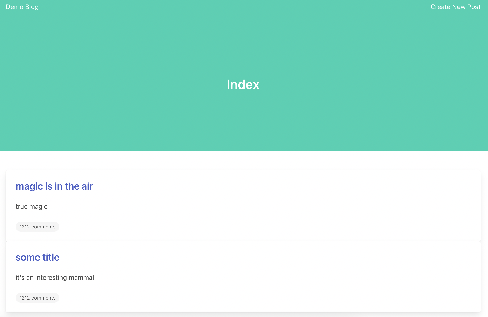
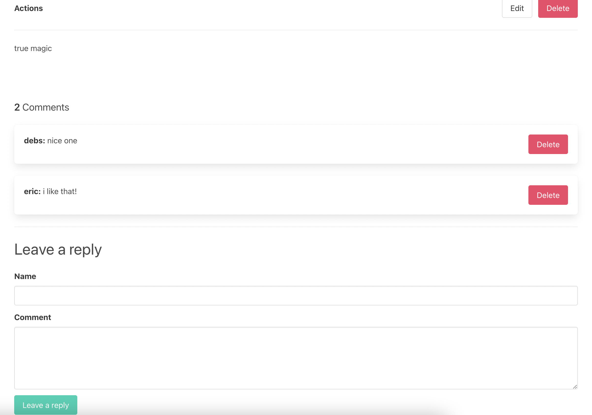

<h1 align="center"> 📰 Demo Ruby Blog 💎</h1>

---


## :dart: About ##
A simple blog to learn more about Ruby on Rails and how to implement a CRUD.

## :rocket: Technologies ##

This project was made using the follow technologies:

* [Ruby](https://www.ruby-lang.org/en/)
* [Rails](hhttps://rubyonrails.org/)
* [Bulma](https://rubygems.org/gems/bulma-rails/versions/0.0.4.1?locale=pt-BR) 

## :computer: How to run ##
```bash
# Clone this project
$ git clone https://github.com/debfdias/Ruby-Blog-CRUD/

# Access folder 
$ cd Ruby-Blog-CRUD

# Install dependencies
$ bundle

# Run the project
$ rails s

# Go to <http://localhost:3000>
```

## :framed_picture: Screenshots ##

<h1 align="center">
    
    
</h1>
